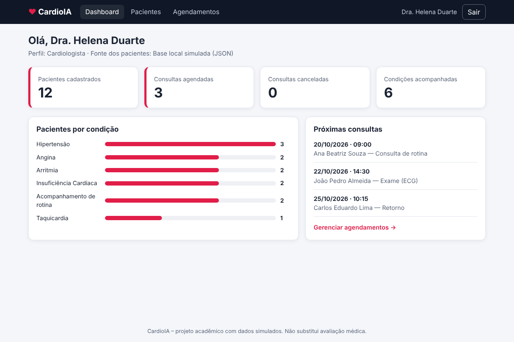
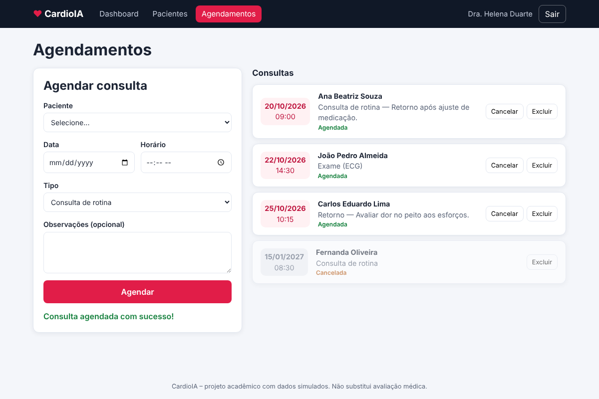
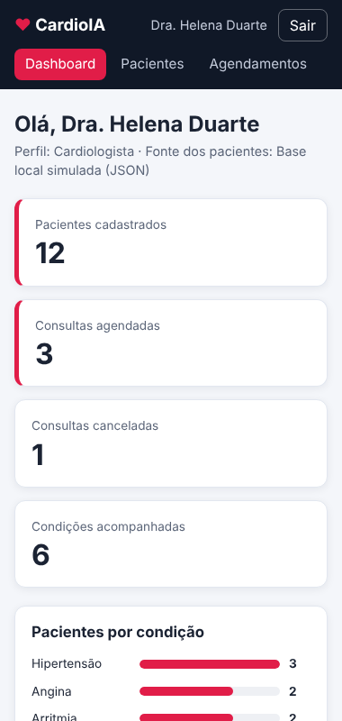

# CardioIA Portal – Ir Além 1 (Front-end em React + Vite)

Portal responsivo que simula a rotina de um sistema de diagnóstico em cardiologia: login, lista de pacientes, agendamento de consultas e dashboard. **Não há back-end**: autenticação, pacientes e agendamentos são simulados.

> ⚠️ Projeto acadêmico, com dados fictícios. Não substitui avaliação médica.

## 🎥 Vídeo de demonstração

**[ADICIONAR AQUI O LINK DO YOUTUBE (NÃO LISTADO)]**

## 👥 Integrantes

| Integrante | RM |
|---|---|
| Adrison Magalhães | RM568165 |
| Anna Carolina Martins Souza | RM566692 |
| Juan Battagin Barrocal | RM567410 |
| Marcela Amorim Fernandes | RM566995 |

## ▶️ Como instalar e executar

Requisitos: [Node.js](https://nodejs.org/) 18 ou superior.

```bash
npm install
npm run dev
```
Abra o endereço mostrado no terminal (normalmente http://localhost:5173).

Outros comandos: `npm run build` (gera a pasta `dist`) e `npm run preview`.

**Login de demonstração:** `medico@cardioia.com` / `123456` (ou `admin@cardioia.com` / `admin123`).

## ✅ Requisitos do desafio e onde estão

| Requisito | Onde está |
|---|---|
| Autenticação simulada via **Context API** (JWT fake no `localStorage`) | `src/contexts/AuthContext.jsx` + `src/services/authService.js` |
| Listagem de pacientes com **API fake** (JSONPlaceholder) ou base simulada | `src/services/pacientesService.js` + `src/contexts/PacientesContext.jsx` |
| Formulário de agendamento com **useState e useReducer** | `src/components/AgendamentoForm.jsx` (useReducer do formulário) e `src/contexts/AgendamentosContext.jsx` (useReducer da lista) |
| **Dashboard** com contagem de pacientes e consultas agendadas | `src/pages/Dashboard.jsx` |
| **Proteção de rotas** com AuthContext | `src/components/ProtectedRoute.jsx` |
| Estilização com **CSS Modules** (responsiva) | arquivos `*.module.css` ao lado de cada componente |

## 🧠 Como funciona

- **Login:** `authService` valida o usuário de demonstração e cria um token no formato `header.payload.assinatura` (assinatura falsa, expira em 1 hora). O token é salvo no `localStorage`; ao recarregar a página, o `AuthProvider` (via `useEffect`) restaura a sessão se o token ainda for válido.
- **Rotas protegidas:** `ProtectedRoute` lê o `AuthContext`. Sem login, redireciona para `/login` (e depois do login volta à página pedida). Os dados de pacientes e agendamentos só são carregados depois do login.
- **Pacientes:** tenta buscar `https://jsonplaceholder.typicode.com/users` e, se estiver sem internet, usa `src/data/pacientes.json`. A tela informa qual fonte foi usada.
- **Agendamentos:** o reducer trata as ações `ADICIONAR`, `CANCELAR` e `REMOVER`; a lista é salva no `localStorage`.
- **Hooks usados:** `useState`, `useEffect`, `useContext`, `useReducer`, `useMemo`, `useCallback` e hooks próprios (`useAuth`, `usePacientes`, `useAgendamentos`).

## 📁 Estrutura

```
src/
├── contexts/     # AuthContext, PacientesContext, AgendamentosContext
├── components/   # Navbar, Layout, ProtectedRoute, StatCard, PacienteCard, AgendamentoForm, AgendamentoLista, Loading
├── services/     # authService, pacientesService, agendamentosService
├── pages/        # Login, Dashboard, Pacientes, Agendamentos
├── hooks/        # useAuth, usePacientes, useAgendamentos
├── data/         # pacientes.json (base simulada)
├── App.jsx       # rotas
└── main.jsx
```

## 🖼️ Telas

| Dashboard | Agendamentos | Celular |
|---|---|---|
|  |  |  |

## ⚖️ Observações de segurança

O JWT é **falso** e gerado no navegador, apenas para fins didáticos. Em um sistema real, o token seria assinado por um servidor e dados de saúde seguiriam a LGPD.
